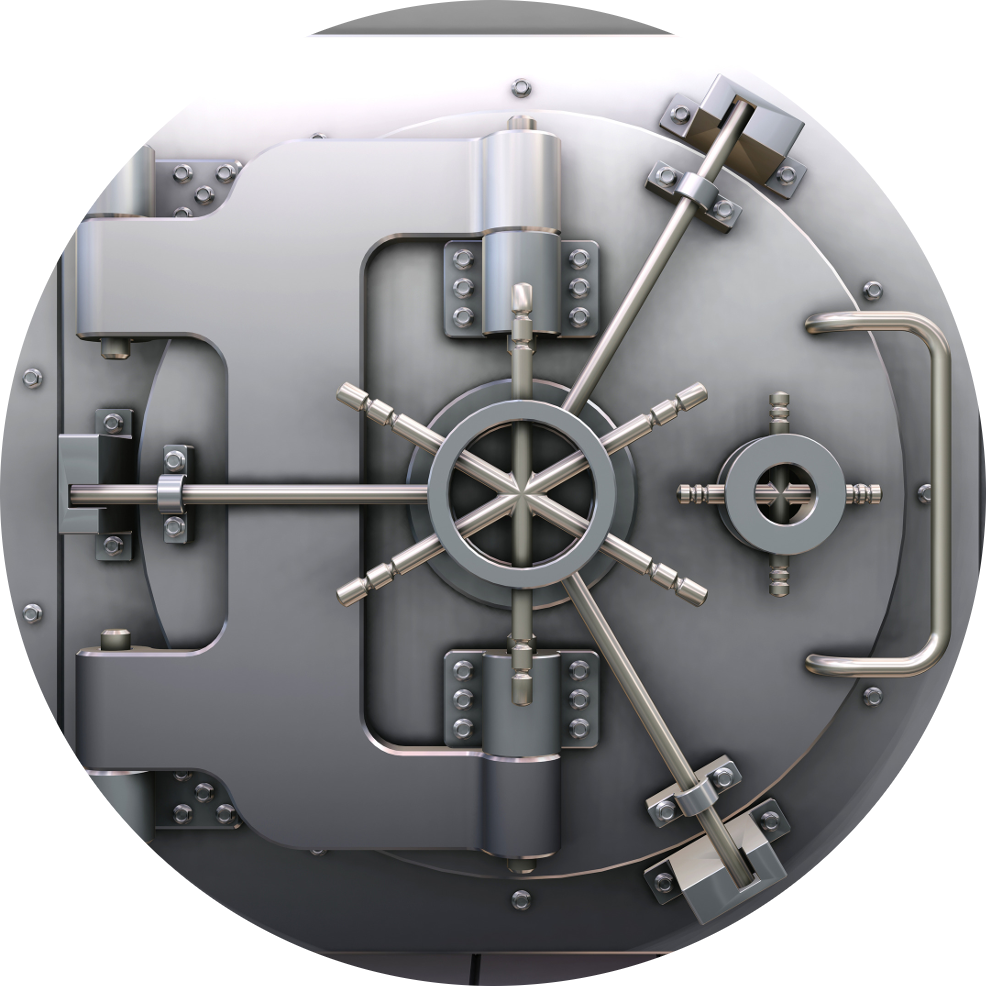
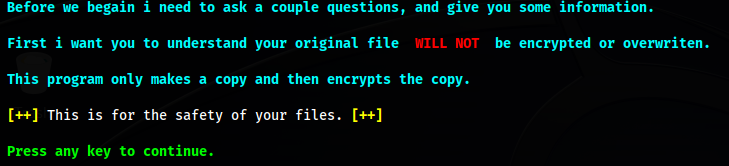
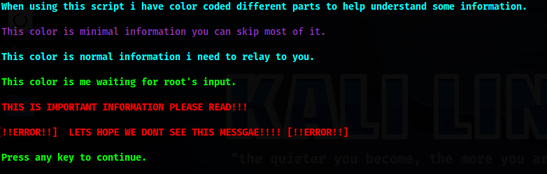
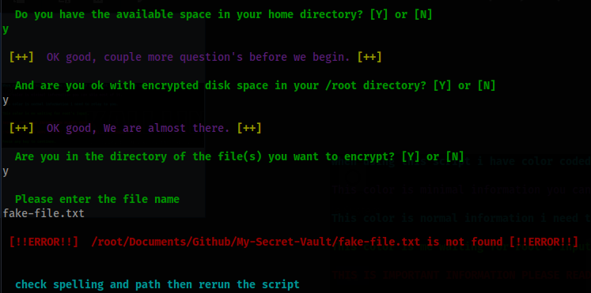

# My Secret Vault - A file encryption and directory hiding tool to stash your most important files.



## Author

Adam Hamilton

- [Github](https://www.github.com/adamhamilton44)

- [Email](blacklisthacker@protonmail.com)

## Contributing

Contributions are always welcome!

See Above for ways to get a hold of me.

## Features

- script encrypts any important file with gpg encryption

- creates a encrypted and hidden directory

- stash the encrypted file in the directory

- close the directory and it's gone until you need it

- a text file is created to explain how to open and de-crypt the file

- lots of error handling so no files are lost

- color coded text so you know what is the most important information

- error messages and script dies anytime you type in the wrong information

- BONUS: Instructions on how to hide the key in a .JPG file

## Script ease

Script has easy to read and understand language so you always make the right decisions.









## Feedback

If you have any feedback, please reach out to me at [Email](blacklisthacker@protonmail.com)

## Optimizations

Script will first base 64 encode a copy of your file, It will not use the file, only copy it.

Next i use ccrypt to encrypt the copied file. Then we use tomb to encrypt a 1 GB (1024 Mib) space from the home directory and encrypt it with a password and key.

Finally the script will place the file in the directory, close the directory, and as far as anyone knows there is nothing to see here. 

All together there are 2 encryption methods done and 1 method of encoding.

To help the user i supply a text file with the needed information to de-crypt the directory and file with easy to copy paste instructions

## Run Locally
Clone the project

```bash
git clone https://github.com/adamhamilton44/My-Secret-Vault.git
```
Go to the project directory

```bash
  cd MySecretVault
```
Copy MySecretVault to $PATH

```bash
  sudo cp MySecretVault /usr/local/bin/MySecretVault
```

Install Dependencies

Script will automatically check and install dependencies, but if you like doing things yourself then:.

```bash
  sudo apt update
  sudo apt install tomb -y
  sudo apt install ccrypt -y
```

Run from anywhere

```bash
MySecretVault
```

## Tested On

- Kali-linux 6.5.0

- Should work on any Debian and Ubuntu system using the apt package manager

## 🚀 About Me

👩‍💻 I'm currently working on more bash scripts

💬 Ask me about anything

📫 How to reach me [Email](blacklisthacker@protonmail.com)

⚡️ Fun fact I am actually a Professional dog trainer.
   [My website](https://good-happy-puppy.com)

# Fund My Projects

Bitcoin: 3ENrACvnNY7AYG7HUvcdwJgZjnpoaQ9Lbt

# Hash

md5    ==> bf9837c5638ac9e3288b88b76f07389e

sha1   ==> f9b6a1723a4c9439c140833e21b0287497b6c235

sha256 ==> 87de4e158d01b74f24b2c38594944c449c92abd8f6db995373151796110176e5

